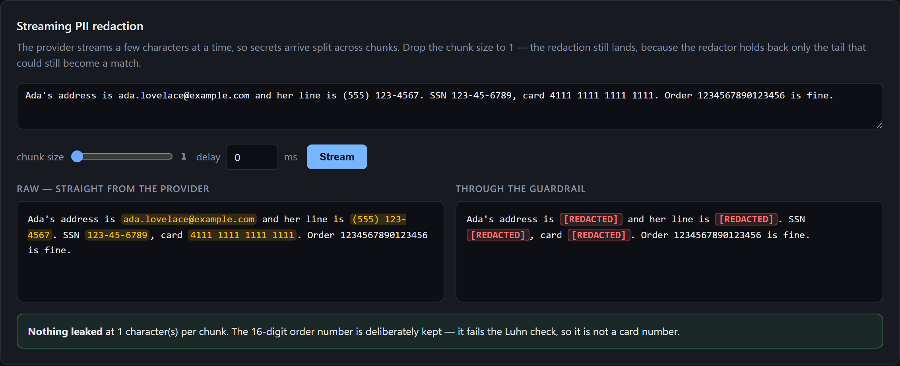
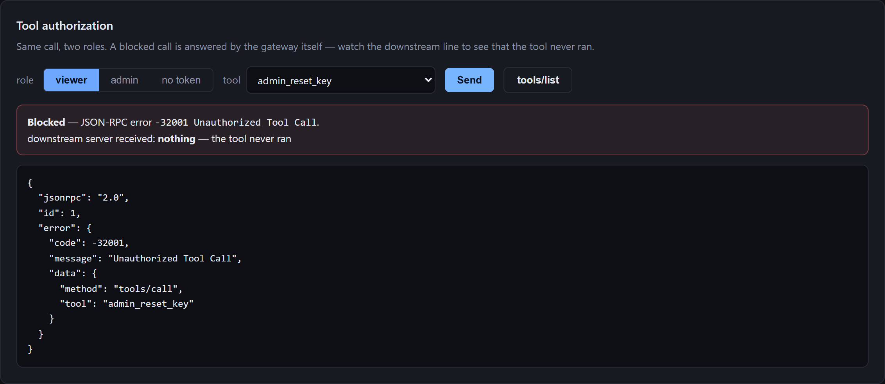
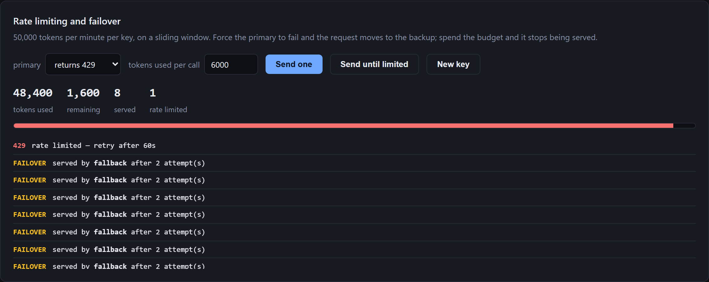

# Demo Console

A single page that drives the three HTTP gateways, so behaviour a curl dump
flattens can actually be watched.

Not part of any service. The gateways are middleware with no user-facing
surface; this is a shop window for them, and nothing depends on it.

## Run it

With the stack up (`docker compose up --build`), open **http://localhost:8000**.

Standalone, against gateways you started yourself:

```bash
uv run python -m demo_console          # :8000
```

Point it elsewhere with `CONSOLE_MCP_GATEWAY`, `CONSOLE_GUARDRAIL`,
`CONSOLE_ROUTER`, `CONSOLE_PROVIDER`, `CONSOLE_MCP_DOWNSTREAM`.

## Panels

### Streaming PII redaction



The same prompt streamed twice: raw from the provider on the left, through the
guardrail on the right. The left pane highlights each secret that reached the
client in the clear; the right shows what a real caller would receive.

The capture is at **one character per chunk** — the worst case, where every
secret arrives split many times over. The redaction still lands, because the
redactor holds back only the tail that could still become a match rather than
scanning each chunk in isolation.

The verdict line underneath is the console's own check: it re-scans the redacted
text for each planted secret instead of trusting the guardrail's report. The
16-digit order number survives on both sides, since it fails the Luhn check and
so is not a card number.

### Tool authorization



A `viewer` calling `admin_reset_key`. The gateway answers it itself with
`-32001`, and the payload below shows exactly what the caller receives.

The line that matters is **downstream server received: nothing**. That is read
from the downstream server's own request log, not inferred from the error code,
so it is evidence the tool never ran rather than a claim that it did not. Switch
the role to `admin` and the same call goes through, with the downstream line
naming the tool it executed.

### Rate limiting and failover



The primary is set to return 429, so each request moves to the backup — the
`FAILOVER` rows, each noting it took two attempts. *Send until limited* keeps
spending until the window refuses, which is the `429` at the top of the log,
carrying the `Retry-After` the limiter computed.

The meter is the sliding window: it turns amber then red as the budget fills,
and the counters separate requests that were served from those refused. *New
key* switches tenant, which is the quickest way to get a fresh 50,000-token
window without waiting a minute for the current one to age out.

## Regenerating the screenshots

They are captured from the running stack, so they can be refreshed rather than
redrawn:

```bash
docker compose up -d
uv run python demo-console/scripts/screenshots.py
```

Each panel is driven to a finished state before capture, so the images show real
responses from the gateways rather than empty forms.

## Notes

Serving the page here rather than opening it from disk keeps the browser on a
single origin, so the gateways need no CORS configuration.

`/api/mcp` reads the downstream server's request log through
`GET /_debug/received`, an endpoint the mock exposes for tests and this console.
A real downstream would not publish its request log.
